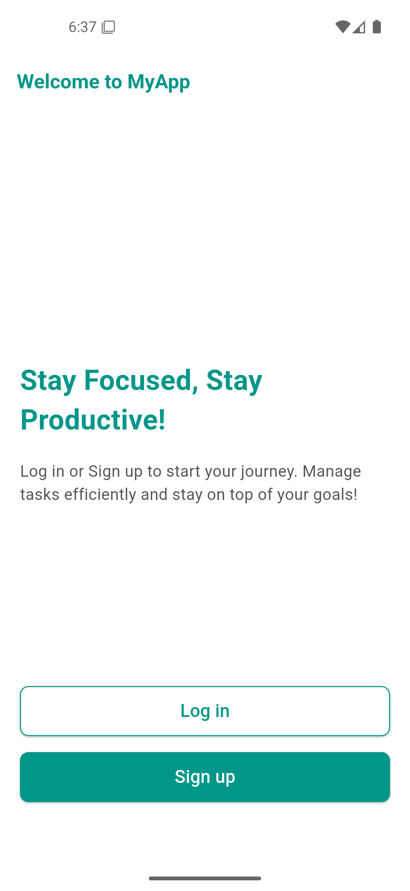
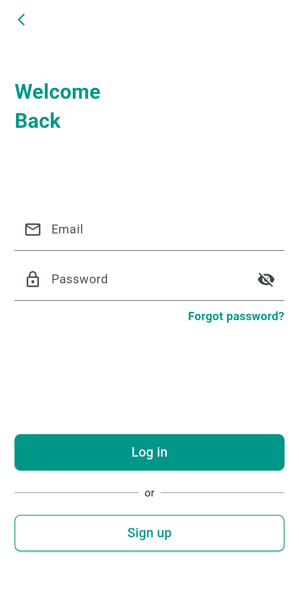
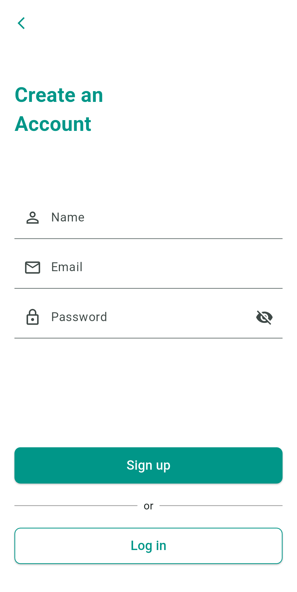

# Login_Screen_UI App

## Description

This app provides a user interface for login and signup functionality. It includes welcome screens, login screens with email validation, signup screens, and utilizes a clean and responsive design.

## Features

- Welcome screens with login and signup button options.
- Login screen with email validation and password visibility toggle.
- Signup screen for creating new accounts.
- Responsive UI design.
- Clean and intuitive interface.

## Mobile Screenshots





## Installation

1. Clone the repository:
   ```bash
   git clone [https://github.com/your-username/login-screen-ui.git](https://www.google.com/search?q=https://github.com/your-username/login-screen-ui.git)  // Replace with your repo URL